# SISOP-3-2026-IT-002
---
## SOAL 1 

Pada soal ini dibuat sistem komunikasi berbasis socket TCP menggunakan bahasa C. Program terdiri dari dua bagian utama:

- Server (`wired.c`) → mengelola koneksi dan broadcast pesan
- Client (`navi.c`) → digunakan user untuk berkomunikasi

Program ini memungkinkan beberapa client terhubung ke server dan saling bertukar pesan secara real-time.

---
## Penjelasan Program

### 1. Server (`weird.c`)

Server bertugas menerima koneksi dari banyak client dan mendistribusikan pesan ke semua client yang terhubung.

**A. Membuat socket:**
```c
socket(AF_INET, SOCK_STREAM, 0);
```
Penjelasan:
- `AF_INET` → menggunakan IPv4
- `SOCK_STREAM` → menggunakan TCP (reliable)
- `0` → protocol default

**B. Binding**
```c
bind(server_fd, (struct sockaddr *)&address, sizeof(address));
```
Menghubungkan socket ke:
- IP: `127.0.0.1`
- Port: `8080`
  
**C. Listen**
```c
listen(server_fd, 5);
```
Server mulai menunggu koneksi client.

**D. Accept client**
```c
int new_socket = accept(server_fd, ...);
```
Setiap client yang masuk akan diterima dan dibuatkan socket baru.

**E. Multithreading**
```c
pthread_create(...)
```
Setiap client ditangani oleh thread berbeda agar bisa multi-user.

**F. Broadcast message**
Server mengirim pesan ke semua client:
```c
send(client[i], message, ..., 0);
```
### Kode Lengkap `wired.c`
```c
#include <stdio.h>
#include <stdlib.h>
#include <string.h>
#include <unistd.h>
#include <pthread.h>
#include <signal.h>
#include <time.h>
#include <arpa/inet.h>

#define PORT 8080
#define MAX_CLIENTS 100
#define BUFFER_SIZE 1024
#define NAME_SIZE 64
#define ADMIN_NAME "The Knights"
#define ADMIN_PASSWORD "protocol124"

typedef struct {
    int socket;
    char name[NAME_SIZE];
    int active;
    int is_admin;
} Client;

Client clients[MAX_CLIENTS];
pthread_mutex_t clients_mutex = PTHREAD_MUTEX_INITIALIZER;
pthread_mutex_t log_mutex = PTHREAD_MUTEX_INITIALIZER;
time_t server_start;
int server_socket;
int server_running = 1;

void timestamp(char *buf, int size) {
    time_t now = time(NULL);
    struct tm *tm_info = localtime(&now);
    strftime(buf, size, "%Y-%m-%d %H:%M:%S", tm_info);
}
void write_log(const char *type, const char *message) {
    pthread_mutex_lock(&log_mutex);

    FILE *fp = fopen("history.log", "a");
    if (fp != NULL) {
        char timebuf[64];
        timestamp(timebuf, sizeof(timebuf));
        fprintf(fp, "[%s] [%s] [%s]\n", timebuf, type, message);
        fclose(fp);
    }

    pthread_mutex_unlock(&log_mutex);
}

void send_message(int socket, const char *message) {
    send(socket, message, strlen(message), 0);
}
void broadcast_message(const char *message, int sender_socket) {
    pthread_mutex_lock(&clients_mutex);

    for (int i = 0; i < MAX_CLIENTS; i++) {
        if (clients[i].active && clients[i].socket != sender_socket && !clients[i].is_admin) {
            send_message(clients[i].socket, message);
        }
    }

    pthread_mutex_unlock(&clients_mutex);
}

int name_exists(const char *name) {
    int exists = 0;

    pthread_mutex_lock(&clients_mutex);

    for (int i = 0; i < MAX_CLIENTS; i++) {
        if (clients[i].active && strcmp(clients[i].name, name) == 0) {
            exists = 1;
            break;
        }
    }

    pthread_mutex_unlock(&clients_mutex);

    return exists;
}
int add_client(int socket, const char *name, int is_admin) {
    int index = -1;

    pthread_mutex_lock(&clients_mutex);

    for (int i = 0; i < MAX_CLIENTS; i++) {
        if (!clients[i].active) {
            clients[i].socket = socket;
            strncpy(clients[i].name, name, NAME_SIZE - 1);
            clients[i].name[NAME_SIZE - 1] = '\0';
            clients[i].active = 1;
            clients[i].is_admin = is_admin;
            index = i;
            break;
        }
    }

    pthread_mutex_unlock(&clients_mutex);

    return index;
}
void remove_client(int socket) {
    pthread_mutex_lock(&clients_mutex);

    for (int i = 0; i < MAX_CLIENTS; i++) {
        if (clients[i].active && clients[i].socket == socket) {
            clients[i].active = 0;
            clients[i].socket = 0;
            clients[i].name[0] = '\0';
            clients[i].is_admin = 0;
            break;
        }
    }
    pthread_mutex_unlock(&clients_mutex);
}

int active_users_count() {
    int count = 0;

    pthread_mutex_lock(&clients_mutex);

    for (int i = 0; i < MAX_CLIENTS; i++) {
        if (clients[i].active && !clients[i].is_admin) {
            count++;
        }
    }

           pthread_mutex_unlock(&clients_mutex);

    return count;
}
void shutdown_server() {
    server_running = 0;

    pthread_mutex_lock(&clients_mutex);

    for (int i = 0; i < MAX_CLIENTS; i++) {
        if (clients[i].active) {
            send_message(clients[i].socket, "[system] Server is shutting down...\n");
            close(clients[i].socket);
            clients[i].active = 0;
        }
    }

    pthread_mutex_unlock(&clients_mutex);
    close(server_socket);
}

void admin_console(int client_socket) {
    char buffer[BUFFER_SIZE];

    while (server_running) {
        snprintf(buffer, sizeof(buffer),
                 "\n=== THE KNIGHTS CONSOLE ===\n"
                 "1. Check Active Entities (Users)\n"
                 "2. Check Server Uptime\n"
                 "3. Execute Emergency Shutdown\n"
                 "4. Disconnect\n"
                 "Command >> ");

        send_message(client_socket, buffer);

        memset(buffer, 0, sizeof(buffer));
        int bytes = recv(client_socket, buffer, sizeof(buffer) - 1, 0);

if (bytes <= 0) {
            break;
        }

        buffer[strcspn(buffer, "\r\n")] = '\0';

        if (strcmp(buffer, "1") == 0) {
            char response[BUFFER_SIZE];
            snprintf(response, sizeof(response), "[Admin] Active users: %d\n", active_users_count());
            send_message(client_socket, response);
            write_log("Admin", "RPC_GET_USERS");
        } else if (strcmp(buffer, "2") == 0) {
            time_t now = time(NULL);
            int uptime = (int)difftime(now, server_start);
            char response[BUFFER_SIZE];
            snprintf(response, sizeof(response), "[Admin] Server uptime: %d seconds\n", uptime);
            send_message(client_socket, response);
            write_log("Admin", "RPC_GET_UPTIME");
        } else if (strcmp(buffer, "3") == 0) {
            write_log("Admin", "RPC_SHUTDOWN");
            write_log("System", "EMERGENCY SHUTDOWN INITIATED");
            send_message(client_socket, "[system] Emergency shutdown initiated.\n");
            shutdown_server();
            break;
        } else if (strcmp(buffer, "4") == 0 || strcmp(buffer, "/exit") == 0) {
            send_message(client_socket, "[system] Disconnecting from The Wired...\n");
            break;
        } else {
            send_message(client_socket, "[system] Invalid command.\n");
        }
    }
}

void *handle_client(void *arg) {
    int client_socket = *((int *)arg);
    free(arg);
    char name[NAME_SIZE];
    char password[NAME_SIZE];
    char buffer[BUFFER_SIZE];
    char message[BUFFER_SIZE + NAME_SIZE + 32];

    send_message(client_socket, "Enter your name: ");
    memset(name, 0, sizeof(name));
    int bytes = recv(client_socket, name, sizeof(name) - 1, 0);

    if (bytes <= 0) {
        close(client_socket);
        return NULL;
    }

    name[strcspn(name, "\r\n")] = '\0';

    if (strcmp(name, ADMIN_NAME) == 0) {
        send_message(client_socket, "Enter Password: ");

        memset(password, 0, sizeof(password));
        bytes = recv(client_socket, password, sizeof(password) - 1, 0);

        if (bytes <= 0) {
            close(client_socket);
            return NULL;
        }

        password[strcspn(password, "\r\n")] = '\0';

        if (strcmp(password, ADMIN_PASSWORD) != 0) {
            send_message(client_socket, "[system] Authentication Failed.\n");
            close(client_socket);
            return NULL;
        }
if (add_client(client_socket, name, 1) == -1) {
            send_message(client_socket, "[system] Server full.\n");
            close(client_socket);
            return NULL;
        }

        send_message(client_socket, "[system] Authentication Successful. Granted Admin privileges.\n");
        write_log("System", "User 'The Knights' connected");
        admin_console(client_socket);
        remove_client(client_socket);
        close(client_socket);
        write_log("System", "User 'The Knights' disconnected");
        return NULL;
    }

    if (name_exists(name)) {
snprintf(buffer, sizeof(buffer), "[system] The identity '%s' is already synchronized in The Wired.\n", name);
        send_message(client_socket, buffer);
        close(client_socket);
        return NULL;
    }

    if (add_client(client_socket, name, 0) == -1) {
        send_message(client_socket, "[system] Server full.\n");
        close(client_socket);
        return NULL;
    }

    snprintf(buffer, sizeof(buffer), "--- Welcome to The Wired, %s ---\n", name);
    send_message(client_socket, buffer);

    snprintf(buffer, sizeof(buffer), "User '%s' connected", name);
    write_log("System", buffer);

while (server_running) {
        memset(buffer, 0, sizeof(buffer));
        bytes = recv(client_socket, buffer, sizeof(buffer) - 1, 0);

        if (bytes <= 0) {
            break;
        }

        buffer[strcspn(buffer, "\r\n")] = '\0';
        if (strcmp(buffer, "/exit") == 0) {
            send_message(client_socket, "[system] Disconnecting from The Wired...\n");
            break;
        }

        snprintf(message, sizeof(message), "[%s]: %s\n", name, buffer);
        broadcast_message(message, client_socket);

        snprintf(message, sizeof(message), "%s: %s", name, buffer);
        write_log("User", message);
}

    remove_client(client_socket);

    snprintf(buffer, sizeof(buffer), "User '%s' disconnected", name);
    write_log("System", buffer);
    close(client_socket);
    return NULL;
}

int main() {
    struct sockaddr_in server_addr, client_addr;
    socklen_t client_len = sizeof(client_addr);
    server_start = time(NULL);

    memset(clients, 0, sizeof(clients));
    server_socket = socket(AF_INET, SOCK_STREAM, 0);

    if (server_socket < 0) {
        perror("socket");
        exit(EXIT_FAILURE);
    }

int opt = 1;
    setsockopt(server_socket, SOL_SOCKET, SO_REUSEADDR, &opt, sizeof(opt));

    server_addr.sin_family = AF_INET;
    server_addr.sin_addr.s_addr = INADDR_ANY;
    server_addr.sin_port = htons(PORT);

    if (bind(server_socket, (struct sockaddr *)&server_addr, sizeof(server_addr)) < 0) {
        perror("bind");
        close(server_socket);
        exit(EXIT_FAILURE);
    }
if (listen(server_socket, MAX_CLIENTS) < 0) {
        perror("listen");
        close(server_socket);
        exit(EXIT_FAILURE);
    }
    printf("[system] SERVER ONLINE on port %d\n", PORT);
    write_log("System", "SERVER ONLINE");

    while (server_running) {
        int *client_socket = malloc(sizeof(int));

        if (client_socket == NULL) {

            continue;
}

        *client_socket = accept(server_socket, (struct sockaddr *)&client_addr, &client_len);
        if (*client_socket < 0) {
            free(client_socket);
            if (!server_running) {
                break;
            }

            continue;
}

        pthread_t tid;
        pthread_create(&tid, NULL, handle_client, client_socket);
        pthread_detach(tid);
}

    write_log("System", "SERVER OFFLINE");
    close(server_socket);
    return 0;
}
```

### 2. Client (navi.c)

**A. Connect ke server**
```c
connect(socket_fd, (struct sockaddr *)&server_addr, sizeof(server_addr));
```
Client terhubung ke server.

**B. Thread receive**
```c
pthread_create(&recv_thread, NULL, receive_messages, &socket_fd);
```
Digunakan agar:
- client bisa menerima pesan
- agar tetap bisa mengetik
  
**C. Kirim pesan**
```c
send(socket_fd, buffer, strlen(buffer), 0);
```
Pesan dikirim ke server.

**D. Exit command**
```c
if (strcmp(buffer, "/exit") == 0)
```
Client keluar dari chat.

### Kode Lengkap `navi.c`
```c
#include <stdio.h>
#include <stdlib.h>
#include <string.h>
#include <unistd.h>
#include <pthread.h>
#include <arpa/inet.h>

#define SERVER_IP "127.0.0.1"
#define PORT 8080
#define BUFFER_SIZE 1024

int running = 1;

void *receive_messages(void *arg) {
    int socket_fd = *((int *)arg);
    char buffer[BUFFER_SIZE];
        while (running) {
        memset(buffer, 0, sizeof(buffer));
        int bytes = recv(socket_fd, buffer, sizeof(buffer) - 1, 0);

        if (bytes <= 0) {
            printf("\n[system] Disconnected from The Wired.\n");
            running = 0;
            break;
        }
        printf("%s", buffer);
        fflush(stdout);
    }

    return NULL;
}
int main() {
    int socket_fd;
    struct sockaddr_in server_addr;
    pthread_t recv_thread;
    char buffer[BUFFER_SIZE];

    socket_fd = socket(AF_INET, SOCK_STREAM, 0);

    if (socket_fd < 0) {
        perror("socket");
        return 1;
    }

    server_addr.sin_family = AF_INET;
    server_addr.sin_port = htons(PORT);
    if (inet_pton(AF_INET, SERVER_IP, &server_addr.sin_addr) <= 0) {
        perror("inet_pton");
        close(socket_fd);
        return 1;
    }

    if (connect(socket_fd, (struct sockaddr *)&server_addr, sizeof(server_addr)) < 0) {
        perror("connect");
        close(socket_fd);
        return 1;
    }
    pthread_create(&recv_thread, NULL, receive_messages, &socket_fd);
    while (running) {
        memset(buffer, 0, sizeof(buffer));

        if (fgets(buffer, sizeof(buffer), stdin) == NULL) {
            break;
        }

if (!running) {
            break;
        }

        send(socket_fd, buffer, strlen(buffer), 0);
        buffer[strcspn(buffer, "\r\n")] = '\0';

if (strcmp(buffer, "/exit") == 0) {
            running = 0;
            break;
        }
    }
            close(socket_fd);
    pthread_cancel(recv_thread);
    pthread_join(recv_thread, NULL);
   return 0;
}
```

## Cara Menjalankan

**1. Compile**
```c
gcc weird.c -o weird -pthread
gcc navi.c -o navi -pthread
```
**2. Jalankan server**
```c
./weird
```
**3. Jalankan client (di terminal lain)**
```c
./navi
```
masukkan client 1 lalu buka lagi diterminal lain untuk menambah client dan juga membuka admin, untuk admin 'The Knights' gunakan password untuk dapat mengaksesnya.

**4. Exit**
```c
./exit
```
gunakan Exit jika ingin Disconnect dari server, dan client keluar dari chat.

**5. hapus program sebelumnya untuk compile lagi**
```c
rm -f wired navi history.log
```
## Output
1. **Compile soal 1** 
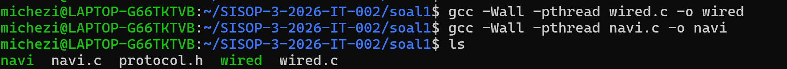
2. **Compile server `wired.c`**
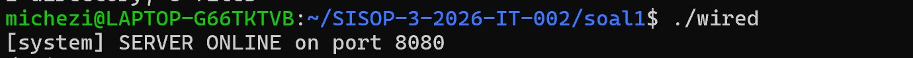
3. **Compile client 1**
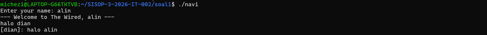
4. **Compile client 2**
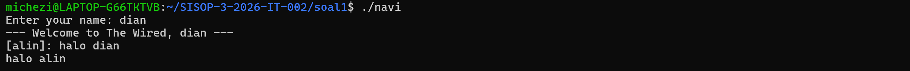
5. **Tes Duplikat client**
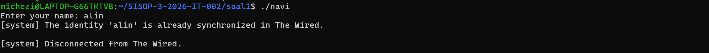
6. **Input Admin `The Knights`**
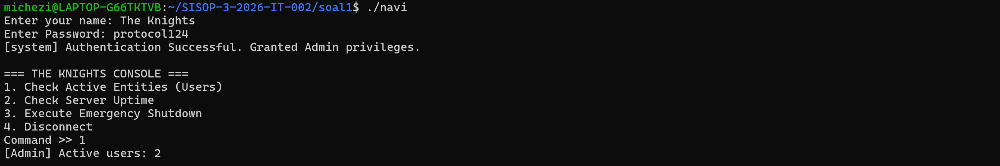
7. **Check Server Uptime**
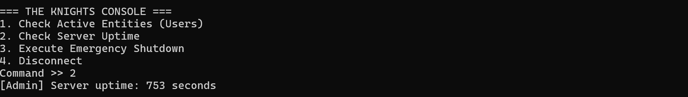
8. **Admin Disconnect**
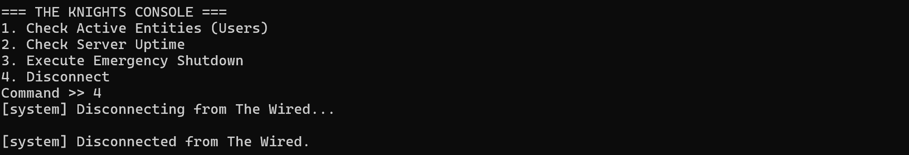
9. **Excute Emergency ShutDown**
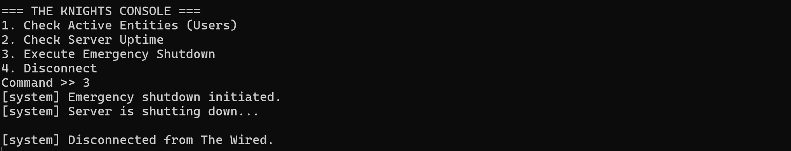
10. **History.log**
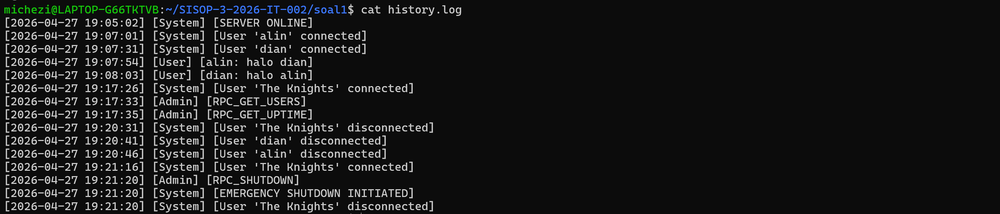

## Kendala
- Kesulitan memahami penggunaan socket TCP di awal
- Sinkronisasi pesan antar client

---
## Soal 2
Pada soal ini dibuat sebuah sistem game sederhana berbasis **shared memory (IPC)** menggunakan bahasa C. Program terdiri dari dua komponen utama, yaitu server (`orion.c`) dan client (`eternal.c`), yang saling terhubung melalui shared memory untuk menyimpan dan mengakses data secara bersamaan.

Server bertugas menginisialisasi dan mengelola shared memory, termasuk data player, status battle, serta sinkronisasi menggunakan mutex. Client digunakan oleh user untuk melakukan berbagai aktivitas seperti registrasi, login, membeli senjata, matchmaking, dan bertarung dalam sistem battle.

## Penjelasan Program
### 1. `arena.h`
File `arena.h` berfungsi sebagai header utama yang menyimpan semua konstanta dan struktur data yang digunakan oleh `orion.c` dan `eternal.c`.

Isi utama dari file ini adalah:

- `SHM_KEY` sebagai key shared memory.
- `Player` untuk menyimpan data player seperti username, password, gold, level, XP, weapon, dan history.
- `Battle` untuk menyimpan status battle seperti nama player, HP, damage, ultimate, log battle, dan pemenang.
- `Arena` sebagai struct utama yang disimpan di shared memory.

Struct `Arena` menjadi pusat data bersama yang dapat diakses oleh server dan client.

```c
typedef struct {
    int magic;
    pthread_mutex_t mutex;
    Player players[MAX_PLAYERS];
    char waiting_player[NAME_SIZE];
    Battle battle;
} Arena;
```
Mutex digunakan agar data shared memory tidak rusak ketika diakses oleh banyak proses secara bersamaan.
### Kode Lengkap `arena.h`
```c
#ifndef ARENA_H
#define ARENA_H
#include <pthread.h>
#include <time.h>

#define SHM_KEY 0x00001234
#define MAX_PLAYERS 50
#define MAX_HISTORY 20
#define NAME_SIZE 50
#define PASS_SIZE 50

#define BASE_HEALTH 100
#define BASE_DAMAGE 10

#define GOLD_START 150
#define LEVEL_START 1
#define XP_START 0
#define MATCH_TIME 35
typedef struct {
    char opponent[NAME_SIZE];
    char result[10];
    int xp_gain;
    char time_text[20];
} History;
        typedef struct {
    char username[NAME_SIZE];
    char password[PASS_SIZE];
    int used;
    int logged_in;
    int gold;
    int level;
    int xp;
    int weapon_damage;
    History history[MAX_HISTORY];
    int history_count;
} Player;
typedef struct {
    int active;
    int bot;
    int rewarded;
    char p1[NAME_SIZE];
    char p2[NAME_SIZE];
    int hp1;
    int hp2;
    int damage1;
    int damage2;
    int ultimate1;
    int ultimate2;
    time_t last_attack1;
    time_t last_attack2;
    char log[5][100];
    int log_count;
    char winner[NAME_SIZE];
} Battle;

        typedef struct {
    int magic;
    pthread_mutex_t mutex;
    Player players[MAX_PLAYERS];
    char waiting_player[NAME_SIZE];
    Battle battle;
} Arena;
#endif
```
### 2. `orion.c`
File `orion.c` berperan sebagai server utama. Program ini bertugas membuat dan menginisialisasi shared memory yang akan digunakan oleh client.

Bagian penting dari program `orion.c`:
```c
shmget(SHM_KEY, sizeof(Arena), IPC_CREAT | 0666);
```
Kode tersebut membuat shared memory dengan ukuran sebesar struct Arena.
```c
shmat(shmid, NULL, 0);
```
Kode tersebut menghubungkan shared memory ke proses `orion`.

`orion.c` juga menginisialisasi mutex agar bisa digunakan antar proses:
```c
pthread_mutexattr_setpshared(&attr, PTHREAD_PROCESS_SHARED);
```
Selain itu, `orion.c` menyediakan beberapa command:
```
users   : melihat semua player
battle  : melihat status battle
reset   : reset arena
exit    : keluar dari server
```
Dengan demikian, `orion.c` berfungsi sebagai pengelola utama shared memory dan pemantau kondisi game.
### Kode Lengkap `orion.c`
```c
#include <stdio.h>
#include <stdlib.h>
#include <string.h>
#include <unistd.h>
#include <sys/shm.h>
#include "arena.h"

void init_arena(Arena *arena) {
        pthread_mutexattr_t attr;

    memset(arena, 0, sizeof(Arena));
    pthread_mutexattr_init(&attr);
    pthread_mutexattr_setpshared(&attr, PTHREAD_PROCESS_SHARED);
    pthread_mutex_init(&arena->mutex, &attr);
    pthread_mutexattr_destroy(&attr);
    arena->magic = 777;
}
        int main() {
    int shmid;
    Arena *arena;
    char command[50];
    shmid = shmget(SHM_KEY, sizeof(Arena), IPC_CREAT | 0666);
    if (shmid < 0) {
        perror("shmget");
        return 1;
    }
    arena = (Arena *)shmat(shmid, NULL, 0);
        if (arena == (void *)-1) {
        perror("shmat");
        return 1;
    }

    if (arena->magic != 777) {
        init_arena(arena);
    }
    printf("Orion is ready.\n");
    printf("SHM_KEY: 0x00001234\n");
    printf("Commands: users, battle, reset, exit\n");
        while (1) {
        printf("orion> ");
        fflush(stdout);
                if (fgets(command, sizeof(command), stdin) == NULL) {
            break;
        }
        command[strcspn(command, "\n")] = '\0';
        if (strcmp(command, "exit") == 0) {
            break;
        } else if (strcmp(command, "users") == 0) {
            pthread_mutex_lock(&arena->mutex);
            printf("\n=== USERS ===\n");
            for (int i = 0; i < MAX_PLAYERS; i++) {
                if (arena->players[i].used) {
                    printf("%s | Gold: %d | Level: %d | XP: %d | Login: %d | Weapon: +%d\n",
                           arena->players[i].username,
                           arena->players[i].gold,
                           arena->players[i].level,
                           arena->players[i].xp,
                           arena->players[i].logged_in,
                           arena->players[i].weapon_damage);
                }
            }
            pthread_mutex_unlock(&arena->mutex);
        } else if (strcmp(command, "battle") == 0) {
            pthread_mutex_lock(&arena->mutex);
            printf("\n=== BATTLE STATUS ===\n");
            if (arena->battle.active) {
                printf("%s vs %s\n", arena->battle.p1, arena->battle.p2);
                printf("HP: %d vs %d\n", arena->battle.hp1, arena->battle.hp2);
                printf("Damage: %d vs %d\n", arena->battle.damage1, arena->battle.damage2);
            } else {
                printf("No active battle.\n");
            }
            pthread_mutex_unlock(&arena->mutex);
        } else if (strcmp(command, "reset") == 0) {
            pthread_mutex_lock(&arena->mutex);
            init_arena(arena);
            pthread_mutex_unlock(&arena->mutex);

            printf("Arena reset.\n");
        } else {
            printf("Unknown command.\n");
            printf("Commands: users, battle, reset, exit\n");
        }
    }
    shmdt(arena);
    return 0;
}
```
### 3. `eternal.c`
File `eternal.c` berperan sebagai client atau program yang digunakan player untuk bermain.

Program ini terhubung ke shared memory yang sudah dibuat oleh `orion.c` menggunakan:
```
shmget(SHM_KEY, sizeof(Arena), 0666);
shmat(shmid, NULL, 0);
```
Fitur utama pada `eternal.c` adalah:
```
Register akun
Login akun
Logout
Melihat profile
Membeli weapon di armory
Matchmaking
Battle PvP atau melawan bot
Menampilkan history battle
```
Setiap kali data shared memory diakses atau diubah, program menggunakan mutex:
```
pthread_mutex_lock(&arena->mutex);
/* akses atau ubah data */
pthread_mutex_unlock(&arena->mutex);
```
Hal ini dilakukan untuk mencegah race condition ketika ada lebih dari satu client yang berjalan bersamaan.

Sistem battle menggunakan command:
```
a : attack biasa
u : ultimate attack
q : keluar dari tampilan battle
```
Damage dan health dihitung berdasarkan XP dan weapon:
```
Damage = BASE_DAMAGE + (XP / 50) + weapon_damage
Health = BASE_HEALTH + (XP / 10)
```
### Kode `eternal.c`
```c
#include <stdio.h>
#include <stdlib.h>
#include <string.h>
#include <unistd.h>
#include <sys/shm.h>
#include <time.h>
#include <sys/select.h>
#include "arena.h"

Arena *arena;

void trim(char *s) {
    s[strcspn(s, "\n")] = '\0';
}
void input_text(const char *label, char *buf, int size) {
    printf("%s", label);
    fflush(stdout);
    if (fgets(buf, size, stdin) == NULL) {
        buf[0] = '\0';
        return;
    }
    trim(buf);
}
int find_player(const char *username) {
    for (int i = 0; i < MAX_PLAYERS; i++) {
        if (arena->players[i].used &&
            strcmp(arena->players[i].username, username) == 0) {
            return i;
        }
    }
    return -1;
}
void time_now(char *buf) {
    time_t now = time(NULL);
    struct tm *t = localtime(&now);
    strftime(buf, 20, "%H:%M", t);
}
.... (selebihnya dapat melihat di soal2)
```
### 4. `Makefile`
File `Makefile` digunakan untuk mempermudah proses compile dan pembersihan file hasil compile.

Command utama:
```
make
```
Digunakan untuk compile `orion.c` dan `eternal.c`.
```
server: orion.c arena.h
	$(CC) $(CFLAGS) orion.c -o orion

client: eternal.c arena.h
	$(CC) $(CFLAGS) eternal.c -o eternal
```
Target `clean` digunakan untuk menghapus file executable:
```
make clean
```
Target `clear_ipc` digunakan untuk menghapus shared memory yang masih tersimpan di sistem:
```
make clear_ipc
```
Bagian ini penting karena shared memory tidak otomatis hilang ketika program ditutup.
### Kode `Makefile`
```
CC = gcc
CFLAGS = -Wall -pthread

all: server client

server: orion.c arena.h
        $(CC) $(CFLAGS) orion.c -o orion

client: eternal.c arena.h
        $(CC) $(CFLAGS) eternal.c -o eternal

clean:
        rm -f orion eternal

clear_ipc:
        ipcs -m | grep 0x00001234 | awk '{print $$2}' | xargs -r ipcrm -m
```
## Output
1. **Compile soal 2** 
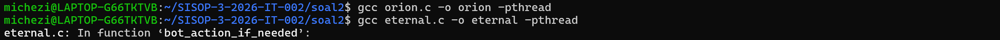
2. **Compile orion** 
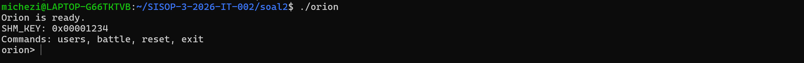
3. **Compile eternal user 1** 
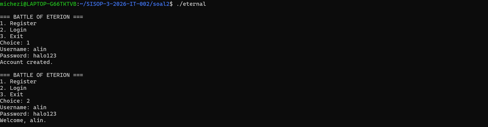
4. **Compile eternal user 2** 
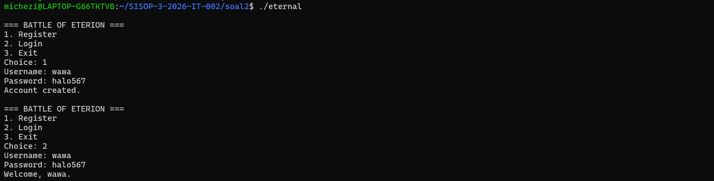
5. **Choose Opsi 1 (Battle user 1)** 
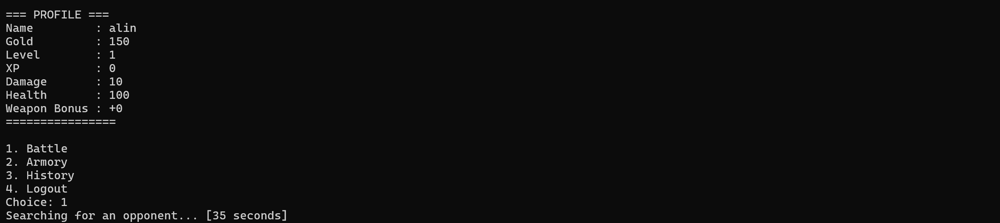
6. **Choose Opsi 1 (Battle user 2)** 
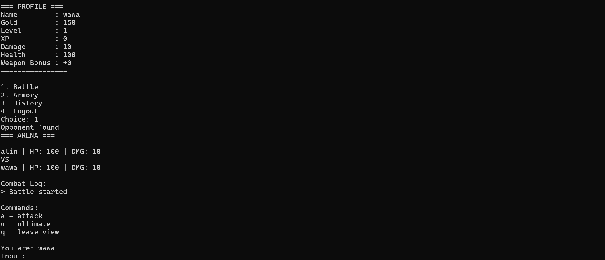
7. **Battle Started** 
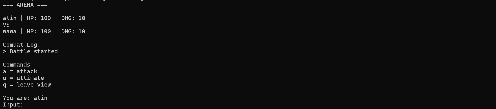
8. **Victory User 1** 
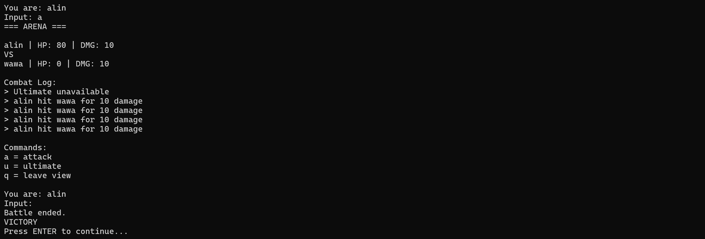
9. **Defeat User 2** 

10. **Check History user 1** 
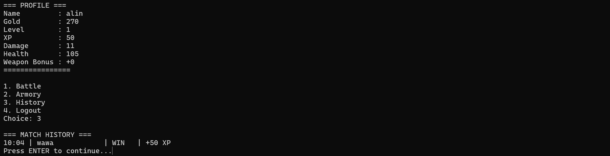
11. **Check History user 2** 
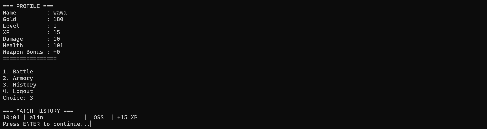
12. **Exit Program**
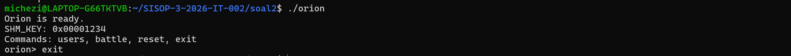

## Kendala
1. Sinkronisasi antar proses  
Program menggunakan shared memory yang diakses oleh banyak client secara bersamaan.
2. Pengelolaan shared memory  
Shared memory tidak otomatis terhapus setelah program selesai.

---


